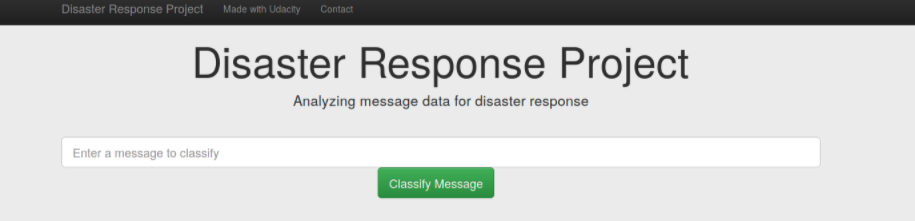

# Disaster Response Pipeline Project

## Table of Contents
1. [Description](#description)
2. [Getting Started](#getting_started)

## Description

This Project is part of Data Science Nanodegree Program by Udacity in collaboration with Figure Eight. The objective of the project was to build a tool that would classify disaster messages into categories - e.g. "water", "fire", "food" to aid responses. The dataset used to train the model contains pre-labelled request messages sent during a natural disaster.

The Project is divided in the following Sections:

1. ETL Pipeline:
- Loads the messages and categories dataset
- Merges the two datasets
- Cleans the data
- Stores in a SQLite database

2. ML Pipeline - builds a model able to classify text message into categories
- Loads data from SQLite Database
- Splits the data into training and test setse
- Builds a text processing and ML pipeline  
- Trains and tunes a model using GridSearchCV
- Outputs result on the test set
- Saves the final model as a pickle file

3. Flask Web App
- allows user to send request messages to model and receive response in real time

## Getting started:
1. Running the ETL pipeline:
      - From the project directory run:
      `python data/process_data.py data/disaster_messages.csv data/disaster_categories.csv data/DisasterResponse.db`
2. Running the ML pipeline:
    - From the project directory run
    `python models/train_classifier.py data/DisasterResponse.db models/classifier.pkl`

3. Starting the flask web app:
  - From the project directory run  
    `python run.py`
  - Go to http://0.0.0.0:3001/
